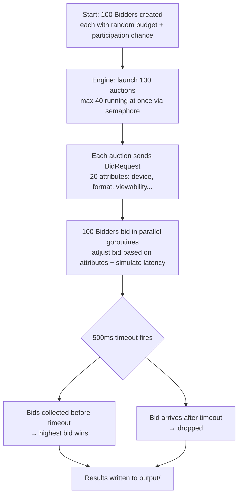
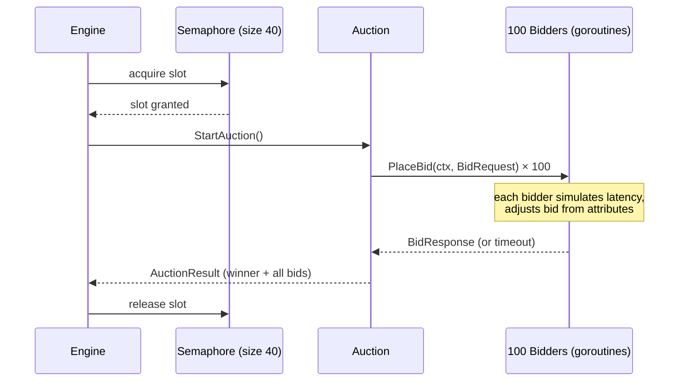

# Auction Simulation

A quick overview, I referenced the [YouTube videos](#references) below to understand how real-time ad auctions work before building this.

Here is a quick video demonstration of the simulation in action: [youtube link](https://youtu.be/MFfqoq2eR84)

The concurrency model is designed to mimic the auction bidding process. I chose simplicity over complexity, the current approach is straightforward and built specifically for the scale mentioned in the task: 100 bidders and 40 concurrent auctions. It uses a semaphore pattern where a buffered channel gates how many auctions run simultaneously, keeping the code easy to follow without sacrificing correctness. Due to time constraints, I opted for this model which is sufficient for the scale mentioned in task.

The current model runs at O(bidders × concurrent auctions) goroutines. At 100 bidders × 40 auctions that's 4,000 goroutines, well within Go's comfort zone. However, at larger scales like 10,000 bidders × 500 concurrent auctions, that's 5 million goroutines which would be problematic. For that scenario, the right move is shifting to a global bid processor pool:

```
Current (simple, fits the task):
  Auction → spawns N goroutines → collects bids

At scale (future improvement):
  Auction → submits jobs to shared pool → waits for responses
  Pool of N workers → pulls jobs → routes responses back
```


## How it runs



## Concurrency model



## Bidder decision logic

Each bidder has a random budget ($1–$15) and participation rate (30–100%). It also adjusts its bid based on the auction attributes:

| Signals that raise the bid | Signals that lower it |
|---|---|
| Premium inventory (+20%) | Remnant inventory (-20%) |
| High viewability (+15%) | Low viewability (-15%) |
| Purchase intent (+15%) | Entertainment intent (-10%) |
| Video ad format (+10%) | |
| Desktop device (+10%) | |

## Run it

```bash
go run ./cmd/simulation/
```

Output lands in `output/`. Serve the dashboard:

```bash
cd output && python3 -m http.server 8080
# open http://localhost:8080/dashboard.html
```

The dashboard shows a live concurrency timeline — every auction as a bar, green = winner, red = no bids, hover for sub-ms timing.

## Config

All parameters are in `internal/config/config.go`:

| Parameter | Default |
|---|---|
| Auctions | 100 |
| Max concurrent | 40 |
| Bidders | 100 |
| Auction timeout | 500ms |
| CPU limit | 2 vCPUs |
| Memory limit | 512 MB |

## Project layout

```
cmd/simulation/main.go       # entrypoint
internal/
  auction/engine.go          # semaphore, runs all auctions
  auction/auction.go         # single auction, for/select bid collection
  bidder/bidder.go           # bid logic, attribute multiplier, timer
  bidder/pool.go             # creates pool with random budgets
  config/config.go           # all parameters
  resource/resource.go       # runtime.MemStats snapshots
  types/types.go             # shared types
  report/writer.go           # summary builder + file writer
  report/dashboard.go        # embedded HTML timeline
```

## References

- https://www.youtube.com/watch?v=ylhKJSrxutM
- https://www.youtube.com/watch?v=Cqki_mlQmkI
